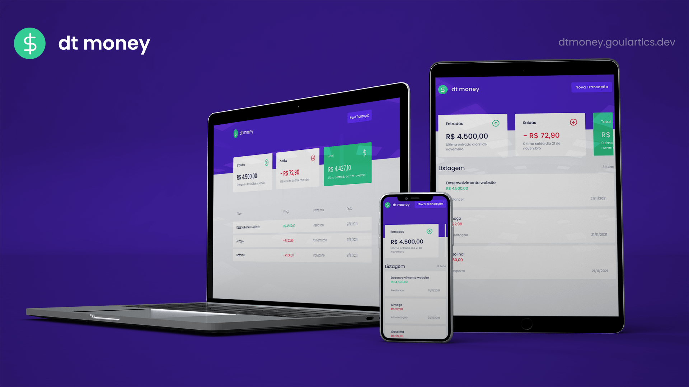
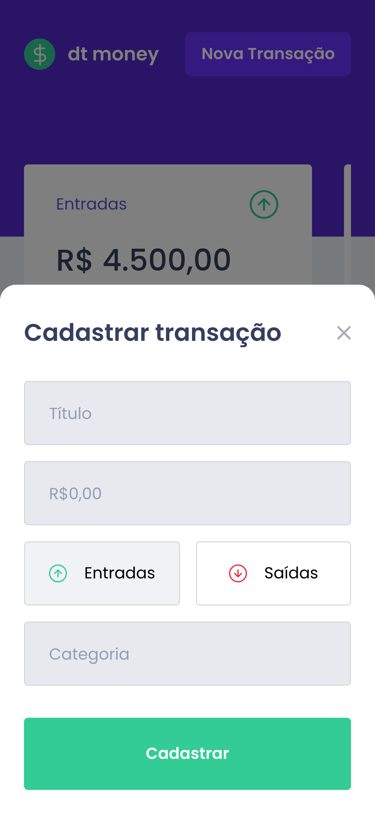
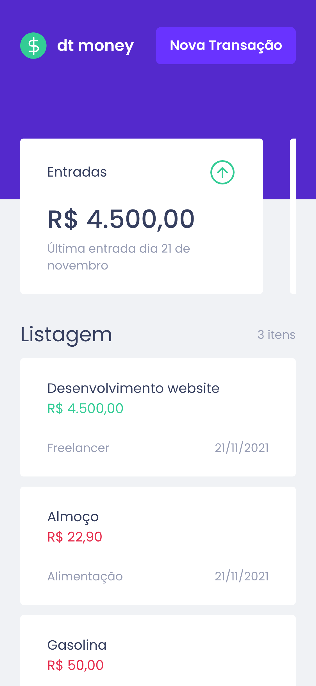
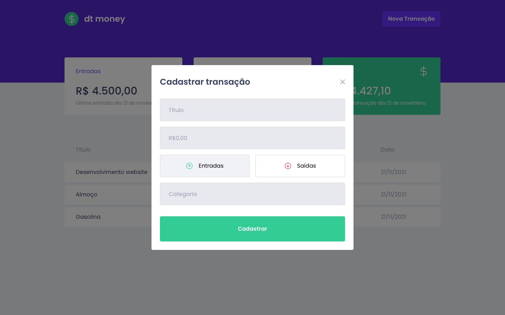
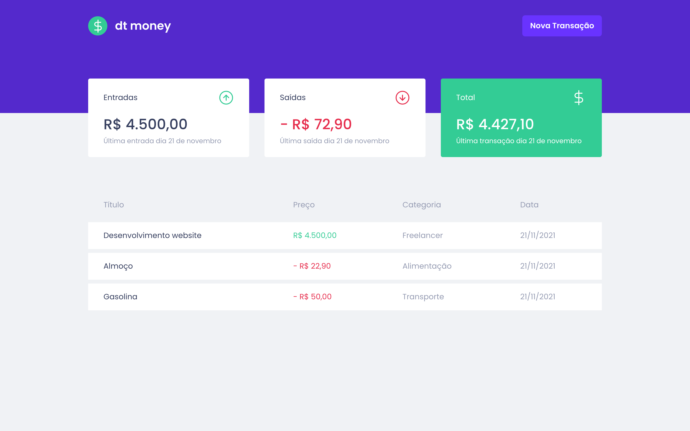

<<<<<<< HEAD
<h1 align="center">
  

  <br />

  <p align="left">
    
  </p>
</h1>

<p>
  Projeto front-end que simula a gestão das finanças pessoais.
  
  Nela, o usuário poderá registrar as transações de entrada, saída de sua conta e ter uma balanço.
</p>
=======
<div align="center">
  <a href="https://dtmoney.goulartlcs.dev/" target="_blank">
    
  </a>

  <br />
  <br />
  <br />

  <a href="https://dtmoney.goulartlcs.dev/" target="_blank">
    
  </a>
  
  <br />
  <br />

  <p align="center">
    Projeto front-end que simula a gestão das finanças pessoais.
  </p>
  <p align="center">
    Nela, o usuário poderá registrar as transações de entrada, saída de sua conta e ter uma balanço.
  </p>
 
  
  <p align="center">
    <a href="https://www.linkedin.com/in/goulartlcs/">
      
    </a>
    
    
    <a href="mailto:lucas@goulartlcs.dev">
     
    </a> 
  </p>
</div>

<br />
<br />

# :art: Layout
O layout da aplicação está disponível no Figma, [clique aqui](https://www.figma.com/file/0xmu9mj2TJYoIOubBFWsk5/dtmoney-Ignite-(Copy)?node-id=0%3A1) para visualizar.

<br />

#### Mobile
<div align="left">
  
  
</div>

#### Desktop
<div align="left">
  
  
</div>

<br />
<br />

# 🧰 Tecnologias
Este projeto foi desenvolvido com as tecnologias listadas abaixo:

- [ReactJS](https://reactjs.org/)
- [Tailwind CSS](https://tailwindcss.com/)
- [date-fns](https://date-fns.org/)
- [react-number-format](https://github.com/s-yadav/react-number-format)
- [react-modal](https://github.com/reactjs/react-modal)

<br />
<br />

# :rocket: Como executar o projeto
```bash
# Clone este repositório
$ git clone https://github.com/goulartlcs/dtmoney.git

# Acesse a pasta do repositório via terminar ou cmd
$ cd dtmoney/

# Instale as dependencias
$ yarn

# Execute o projeto
$ yarn start
```
>>>>>>> 1e4c180bc31ab083942a30a7a26d75d1e5944beb
